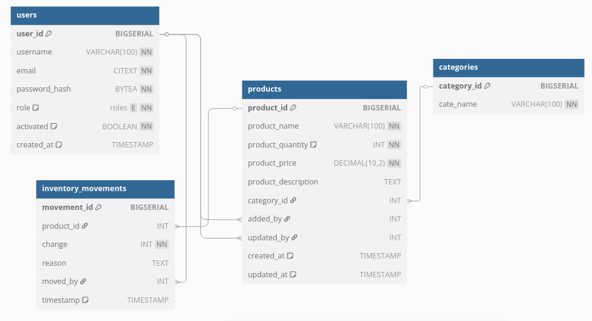

# Test1

The Date-base is set to hold user, the tables that is being used in test 1 is products.

# Program Run
This project uses the default make file structure
- make run - to start at port 5000
- make db/psql - to open the database.

# Database 
- to run the migration first comment the ALTERS for products

# Templates 
- main.tmpl - is the home Screen for my website
- product.tmpl - is the insert form 
- view. tmpl - is the page that shows all the data
