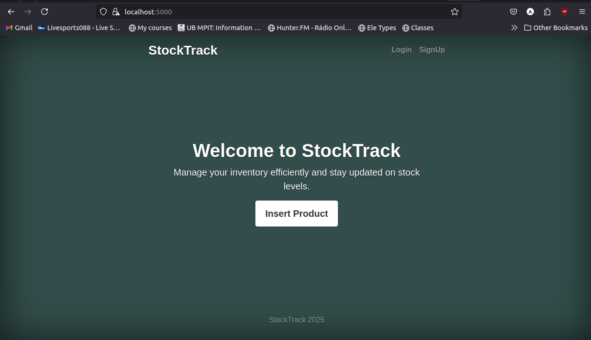

# Project Overview

This project implements a user management and inventory system. The database is structured to store user information, and the **products** table is used for Test 1.

## Program Execution

This project follows the default Makefile structure. Below are the commands to build and run the application:

- `make run`: Start the server on port 5000.
- `make db/psql`: Open the PostgreSQL database.
- **Note**: The category database will be activated once user roles are properly configured.

## Database Setup

- Before running the migration, comment out the **ALTERS** for the **products** table to ensure smooth execution.

## Templates

- **main.tmpl**: Home screen of the application.
- **product.tmpl**: Form used to insert product data.
- **view.tmpl**: Page displaying all the products in the database.

## User Authentication

Each route is protected by user authentication. Only authenticated users can insert data into the inventory, ensuring proper access control.

## User Interface

### Main Page

The homepage of the application, providing navigation and an overview of the system.

### Insert Page

The form used by users to insert new products into the inventory.

### View Page

This page displays all products in the database.

### Edit Page

The form for editing existing product details.

### View After Edit

This page shows the updated data after editing a product.